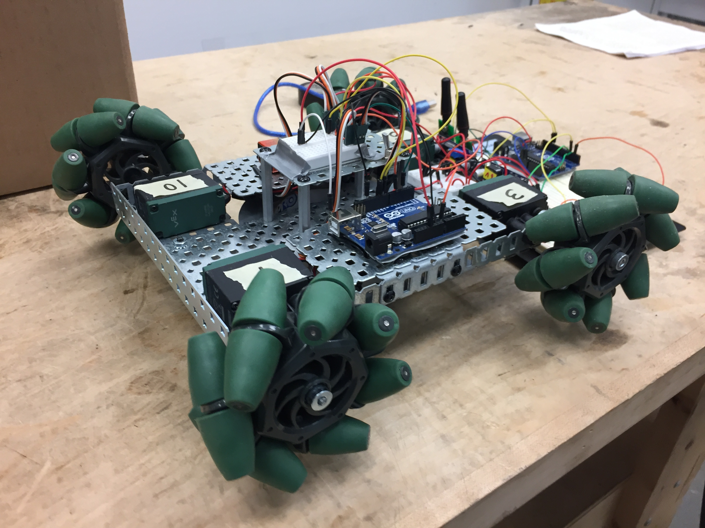
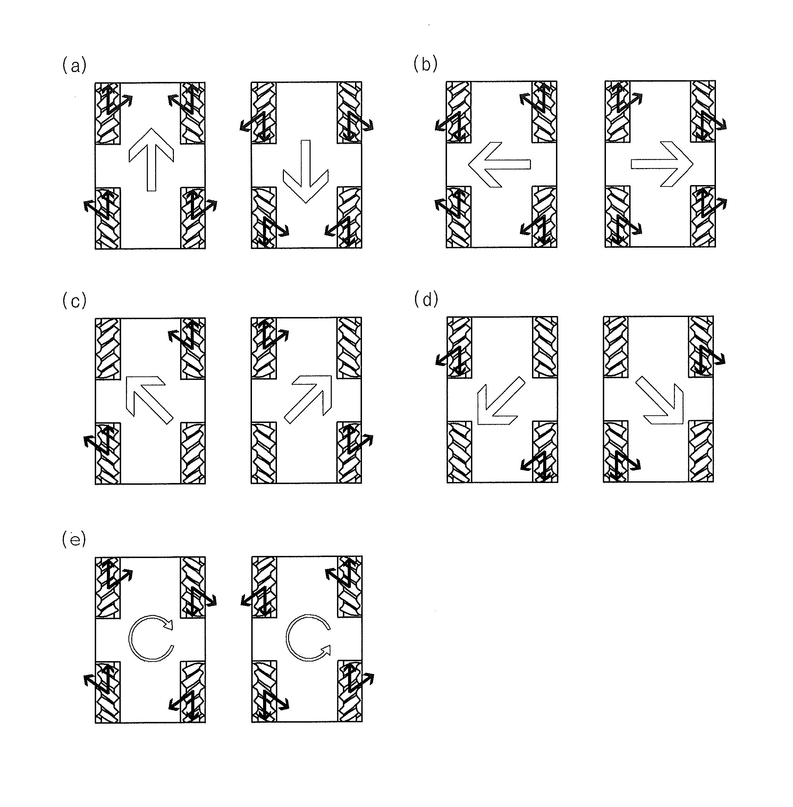

# IEEE Mecannum Wheel Robot Project
## Overview
This project is about developing a simple Meccanum wheel robot with RF control. Meccanum wheels are very cool pieces of hardware that allow for omnidirectional movement with a conventional (car-like) wheel arrangement.

### What the hardware currently looks like:

### A guide to meccanum wheel usage:

*Source: US Patent US20130068543 A1*